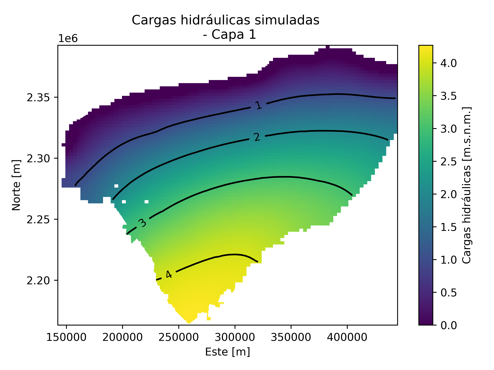

## Yucatan_hidrogeological_model_PEST_AI

## Overview:
This repository contains numerical and AI-assisted workflows for steady-state hydrogeological 2-layers modeling of the Yucatán karst aquifer.
The project integrates MODFLOW 6 simulations, PEST++ based calibration, and emulator-based machine learning tools for parameter exploration and model evaluation.

## Example with labels

| (a) Calibrated Case D - Layer 1 | (b) Calibrated Case D - Layer 2 |
|---|---|
|  |  |
| *Calibrated Case D - Layer 1* | *Calibrated Case D - Layer 2* |

## Repository structure:
- 'AI/': Scripts for the emulator, training, calibration, and verification scripts
- 'yucatan_modelA/': model files and calibration workflow for Case A (homogeneus case)
- 'yucatan_modelB/': model files and calibration workflow for Case B (high-hydraulic conductivity at cenotes ring zone)
- 'yucatan_modelC/': model files and calibration workflow for Case C (low-hydrualic conductivity at upland zone)
- 'yucatan_modelD/': model files and calibration workflow for Case D (integration of Cases A,B and C)

## Requirements:
- Python 3.x
- MODFLOW 6
- PEST++
- Geospatial files (DEM, population raster, coastline, cenotes ring shapefile, mexican republic shapefile)
- Required python packages listed in the corresponding scripts/environment files

## Usage: 
1. Prepare the model input files
2. Run the forward groundwater model
3. Run the calibration of the reference case: Case D on quadtree grid
4. Train the forward emulator in 'AI/'
5. Run emulator-based calibration
6. Verify the calibrated parameter set with MODFLOW 6

